# Kaggle Intro
- 이번 문서에서는 Kaggle의 각 파트에 대해 설명해드리겠습니다. 시기에 따라 형태가 달라질 수 있습니다!
- 캐글은 2010년 설립된 예측모델 및 분석대회 플랫폼입니다. 기업 / 단체에서 데이터와 해결 과제를 등록하면 데이터 과학자들이 해결하는 모델을 개발하고 경쟁합니다
- 데이터 분석 직군에서 일하시고 싶은 분들이라면 반드시 경험하면 좋을 플랫폼이라고 생각합니다
- 2017년 3월에 Google이 Kaggle을 인수했습니다

## Kaggle의 Competitions
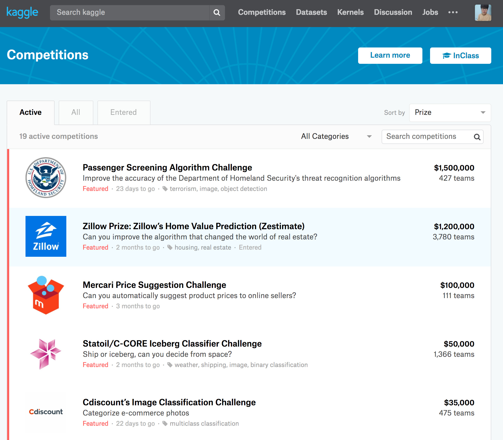

- 이 부분에는 현재 열려있는 competition이 나와있습니다. 
- 카테고리는 Featured, Research, Recruitment, Getting Started, Playground 등이 있습니다. 카테고리별마다 다른 색을 띄고 있습니다
- Featured에 주 메인 대회들이 존재하고, Getting Started엔 Tutorial로 하면 좋을 대회들이 존재합니다
- 위쪽에 All 탭을 클릭하면 과거에 진행된 대회들도 볼 수 있습니다!
- 몇 팀이 참여했는지, 총 상금이 얼마인지 등에 대해 나와있습니다

## Kaggle의 Datasets
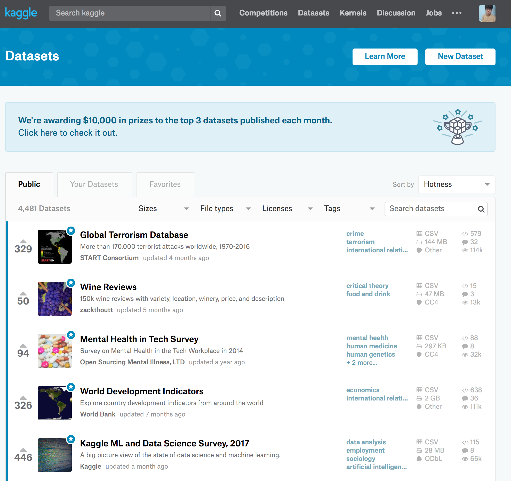

- 이 부분에는 공개된 데이터셋이 있습니다!
- 매달 캐글에서 상위 3개의 dataset에 상금을 부여하고 있습니다!
- 일반 사용자라면 흥미로운 데이터를 사용하고, 해당 데이터를 사용한 커널 및 Discussion을 볼 수 있습니다

## Kaggle의 Kernels
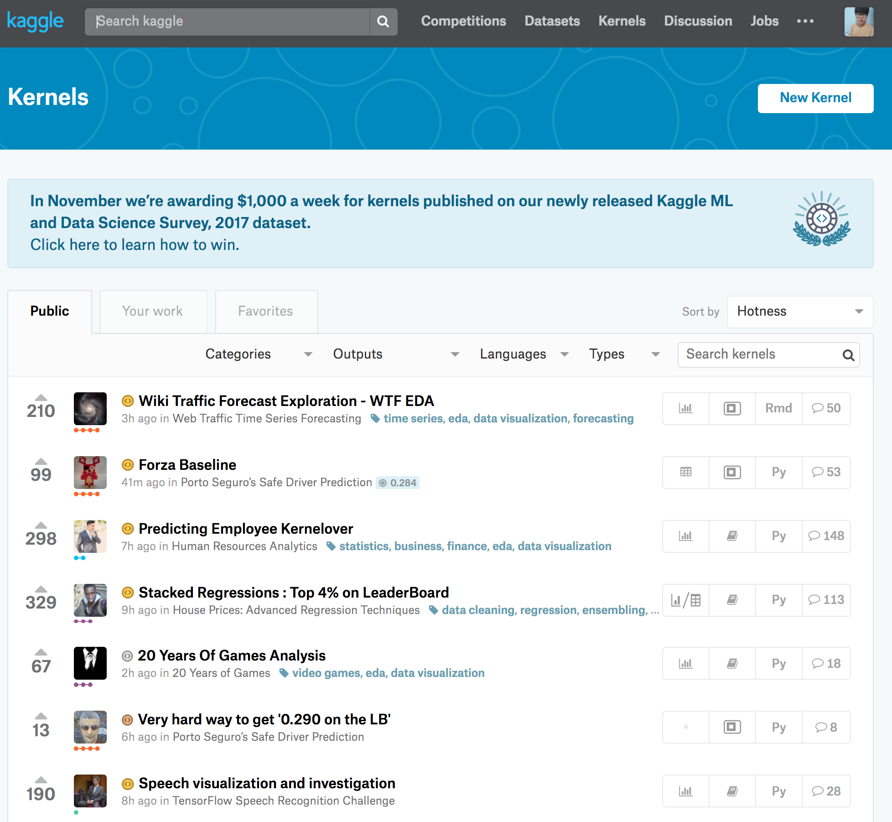

- Kaggle에는 커널이 존재합니다. 커널은 쉽게 생각하면 코드들이라고 생각하시면 됩니다. 스크립트 파일 혹은 쥬피터 노트북 파일이 주로 올라옵니다
- 데이터 전처리, EDA, 모델링 등 다양한 주제에 대해 커널이 올라옵니다. 
- 캐글은 기본적으로 자신의 방법을 공유하는 것에 거리낌이 없습니다. 여러분들도 커널을 작성하셔서 올려보세요-! 커널에 대한 상금도 준비되어 있습니다
- Python, R, SQLite, Julia 언어로 구성되어 있습니다

## Kaggle의 Discussion
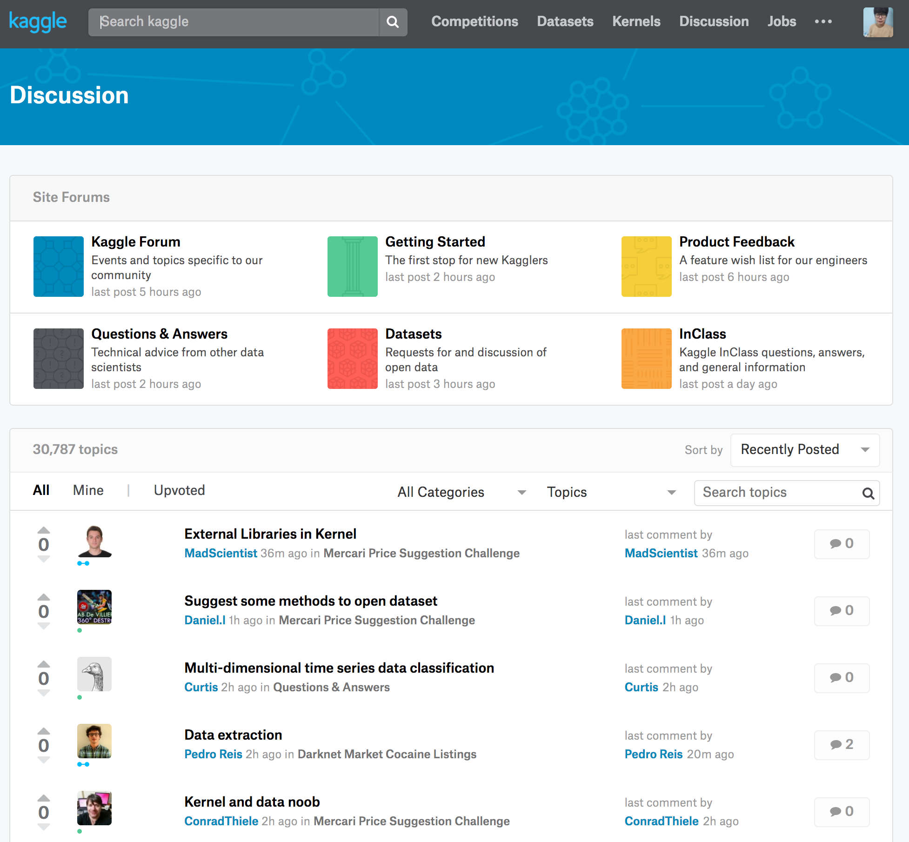

- Discussion은 뜻 그대로 토론을 뜻합니다. 게시판에 써있는 글이라고 생각하시면 좋을 것 같습니다
- 각 대회 우승자들이 자신의 모델에 대해 작성하는 경우도 있습니다! 

## Kaggle의 Jobs

- 이 부분은 구인공고가 나와있는 곳입니다
- 최근 캐글 경력을 인정해주는 회사가 많아졌으니 한국이 아닌 해외에서 취업을 준비하시는 분들이 보시면 좋을 것 같습니다 ( 구독도 할 수 있어요-! )

## Kaggle의 My Profile
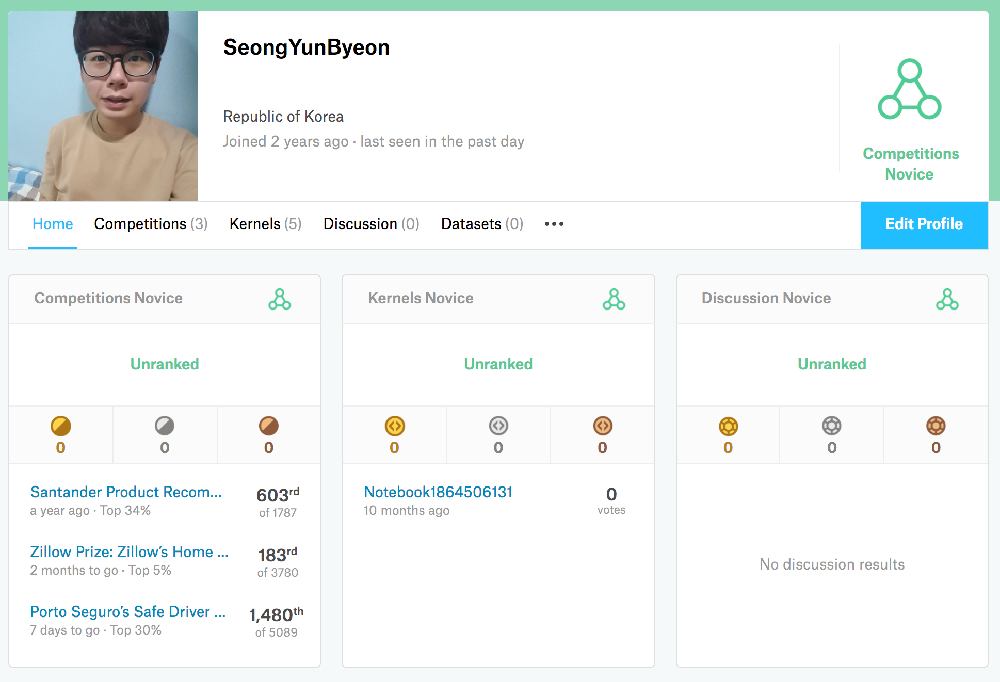

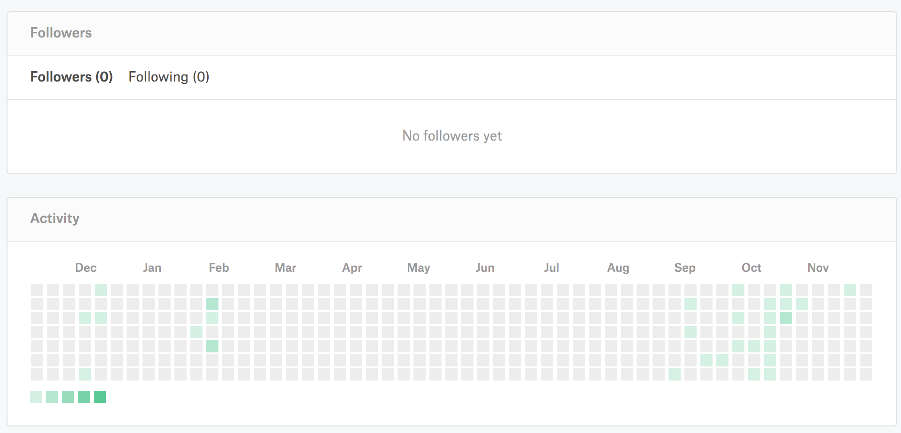

- My Profile 부분입니다. 현재 참여한 대회, 작성한 Kernels, Discussion에 대해 내용이 나와있습니다
- 하단엔 Github처럼 Kaggle을 사용한 흔적이 남아있습니다!

#### 이제 대회에 해당하는 부분에 대해 설명드리겠습니다. Tensorflow Korea에 올라온 대회를 기반으로 설명하겠습니다!

## Kaggle Competition Overview
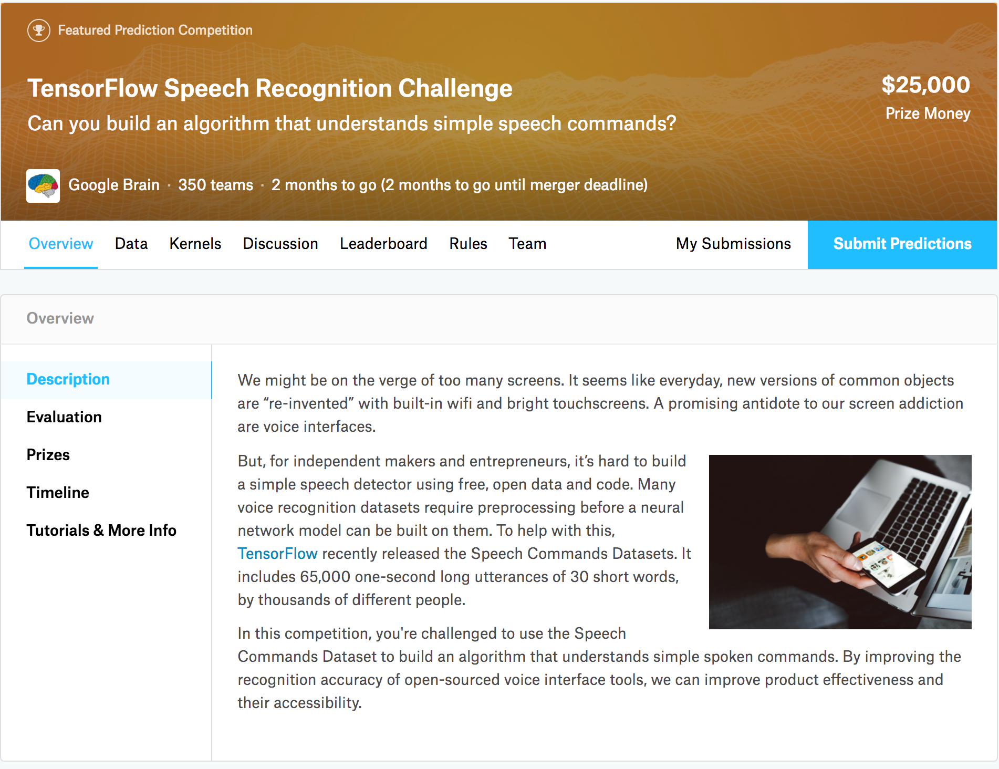

- 말 그대로 Overview 페이지입니다
- 이 대회의 요약 내용, 평가 방법, 수상 혜택, 일정 등의 정보가 나와있습니다
- 특히 Evaluation에서 어떤 지표로 평가하는지 파악하시는 것이 중요합니다!!!

## Kaggle Competition Data
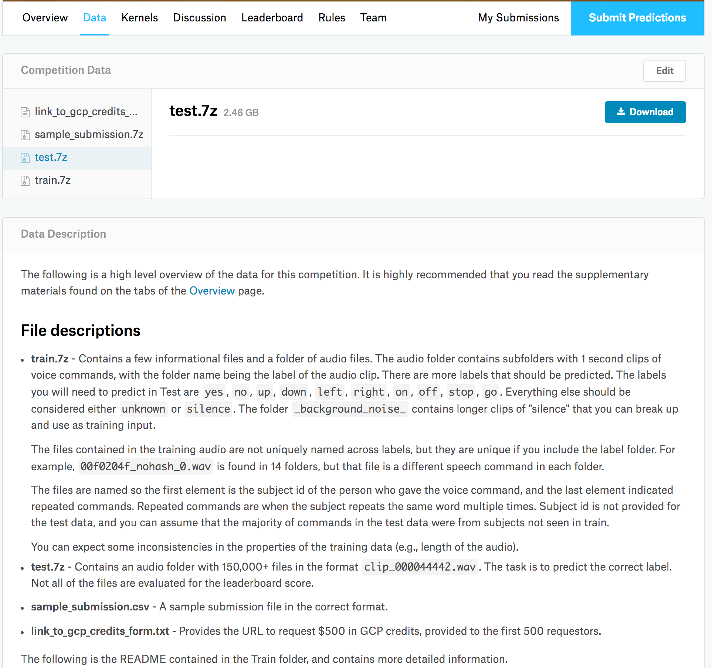

- Kaggle Competition의 Data 부분입니다
- Train, Test, Sample, Submission Data등이 존재합니다
- Submission에선 대략적인 형태가 주어집니다! submission file을 읽고 라벨을 덮어씌운 후, 제출하는 방식으로 사용합니다

## Kaggle Competition Kernels
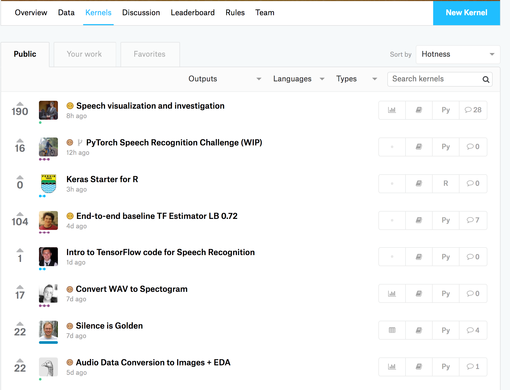

- 위에서 나온 Kaggle Kernel은 전체 게시판이라고 보면 되고, 이 부분은 해당 Competition의 Kernels들만 따로 모여있습니다!

## Kaggle Competition Discussion
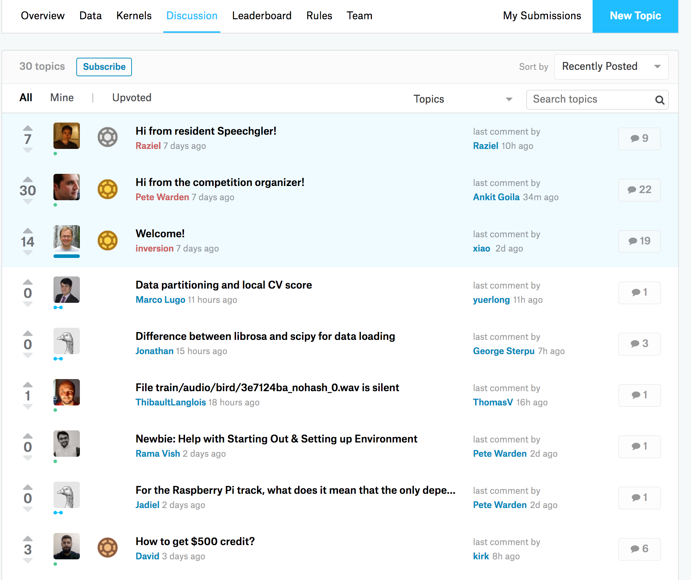

- Kernels과 유사하게 해당 Competition의 Discussion이 모여있습니다!!

## Kaggle Competition Leaderboard

- Leaderboard엔 해당 대회의 랭킹이 나와있습니다!!!
- 팀별 Score가 나오고, 몇번 제출했는지(Entries)도 나옵니다
- Public Leaderboard와 Private Leaderboard가 존재합니다!
- Public 리더보드는 주어진 Dataset에 기반한 점수이고, Private 리더보드는 추가 랭킹을 산정할 때 사용하는 Dataset에 기반한 점수입니다! 실제로 Public에선 점수가 높았으나 Private에서 낮아지는 경우도 존재합니다(오버피팅..)

## Kaggle Competition Team
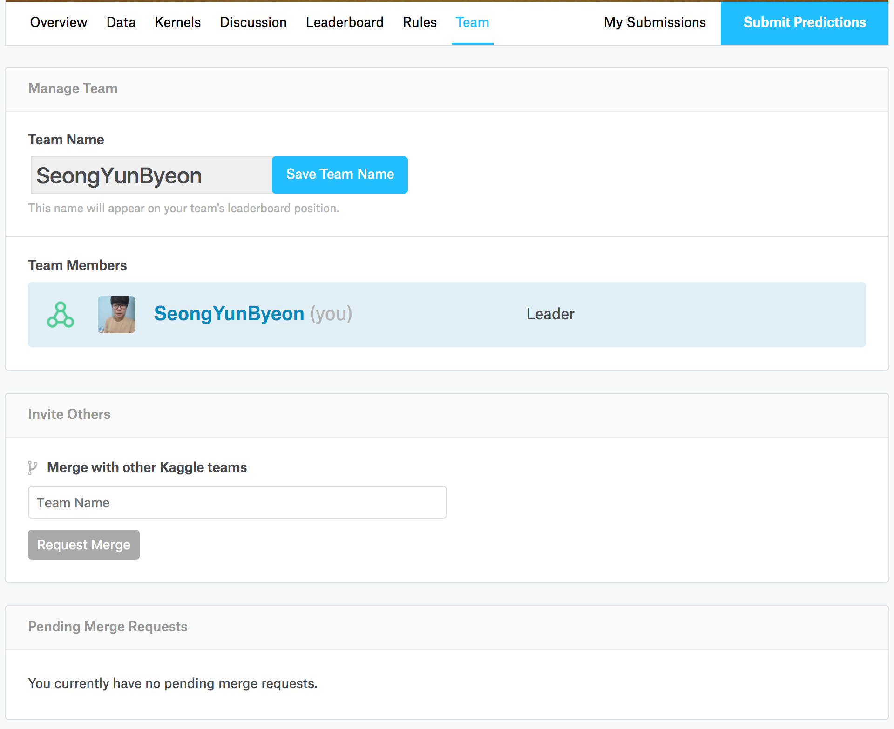

- Kaggle은 대회별로 팀을 꾸려 진행할 수 있습니다
- 팀은 대회별로 3명 혹은 4명정도로 꾸릴 수 있습니다!
- 팀 이름을 설정하고 멤버를 초대할 수 있습니다
- 캐글은 진행되고 있는 대회라면 1일 5회 제출할 수 있습니다. 팀으로 합쳐지면 팀당 1일 5회 제출할 수 있습니다. 초반엔 개인으로 진행하다 마지막에 팀으로 합치는 방법도 추천드립니다!!

## Kaggle Competition my submissions
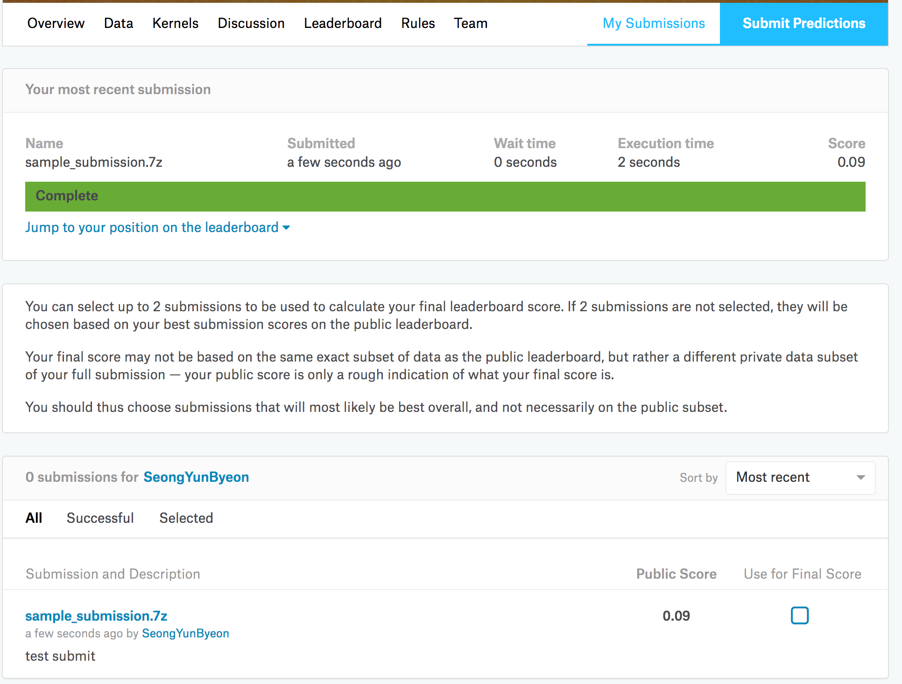

- 제출을 1번이라도 하면 해당 페이지에 위와 같이 나옵니다
- 제출했던 Description과 Public Score 그리고 최종 Score로 선택할 수 있습니다
	- 최종 Score는 제출했던 것 중 2개를 고르곤 합니다!

## Kaggle Competition submit predictions

- 해당 페이지에선 submission file을 제출합니다!
- Upload시 Description을 자세히 남겨두면 유용합니다(하이퍼 파라미터같은 것들!)
- csv 파일로 업로드해도 좋지만 압축 형태로 올리는 것이 다운로드, 업로드 속도면에서 좋습니다!!

#### 이상으로 Kaggle 플랫폼에 대한 설명을 끝내겠습니다 :)